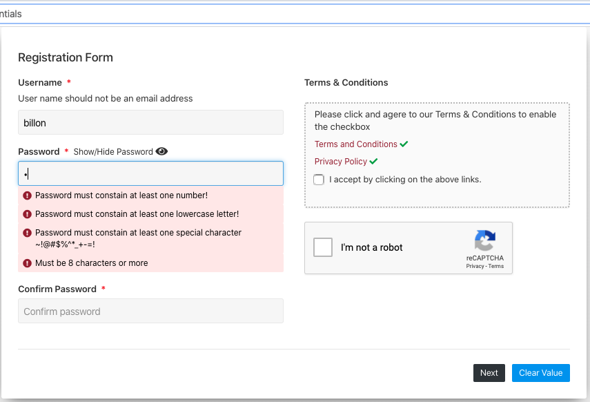
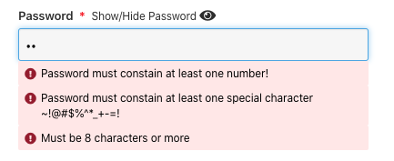
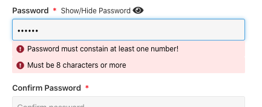
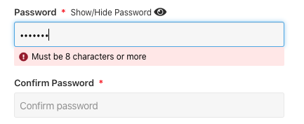
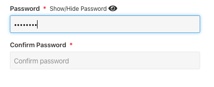

# Online registration form with input validation
## A sample registration form build on react. Using redux-from for validation, showing validation message dynamically as you type.

## See the application in action

This sample application is build with React 16.12 and redux-form 7.4.2

## Main features

For security reason, the password field has complicated validation rules.

These rules are dynamiclly updated as the user types.

### When the user type the first capital letter, it shows what other rules haven't been met yet

### As the user types more, the warning messages are updated

### When all rules are met, no more warning messages.

