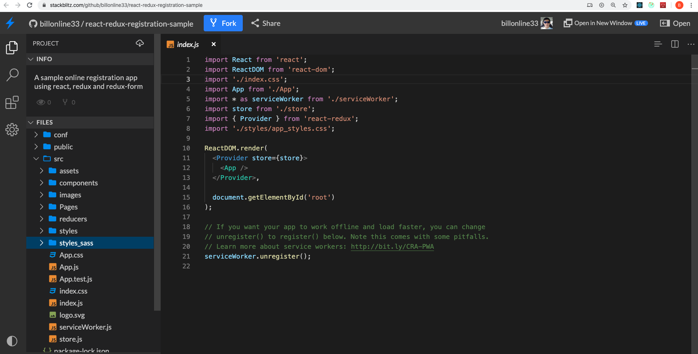

# Online registration form with input validation
## A sample registration form build on react. Using redux-from for validation, showing validation message dynamically as you type.

## See the application in action

Run it on [StackBlitz](https://stackblitz.com/github/billonline33/react-redux-registration-sample) 

This sample application is build with React 16.12 and redux-form 7.4.2

## Main features

For security reason, the password field has complicated validation rules.

* Password must constain at least one uppercase letter!
* Password must constain at least one lowercase letter!
* Password must constain at least one number!
* Password must constain at least one special character ~!@#$%^*_+-=!
* Must be 15 characters or less
* Must be 8 characters or more
* Can only include - letter, number or special character $ :%.;*,"&?\'#=!/\\_|(){}-

These rules are dynamiclly updated as the user types.

### After the user types the first capital letter, it shows what other rules haven't been met yet

### As the user types more, the warning messages are updated

### As the user types more, the warning messages are updated

### As the user types more, the warning messages are updated

### When all rules are met, no more warning messages.

